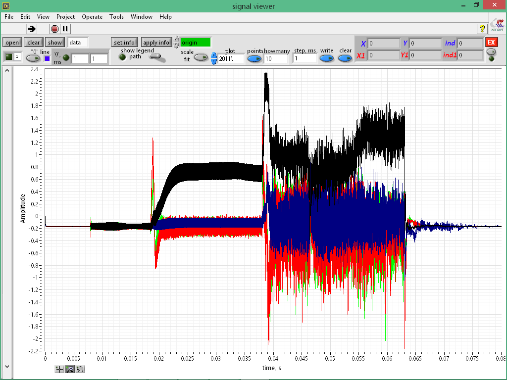
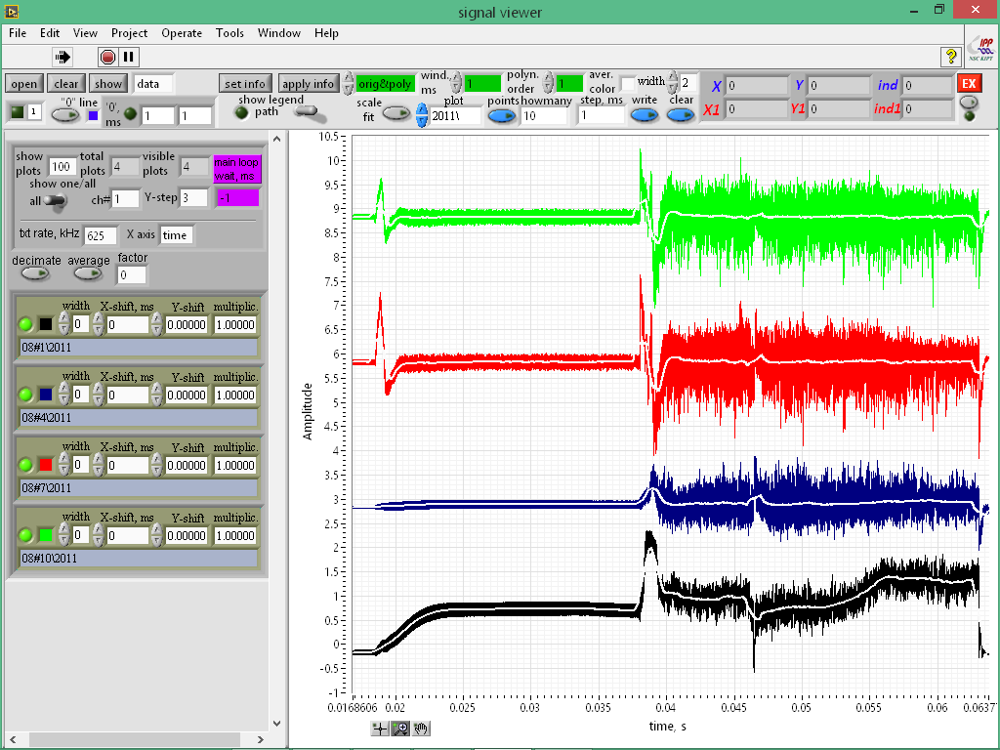
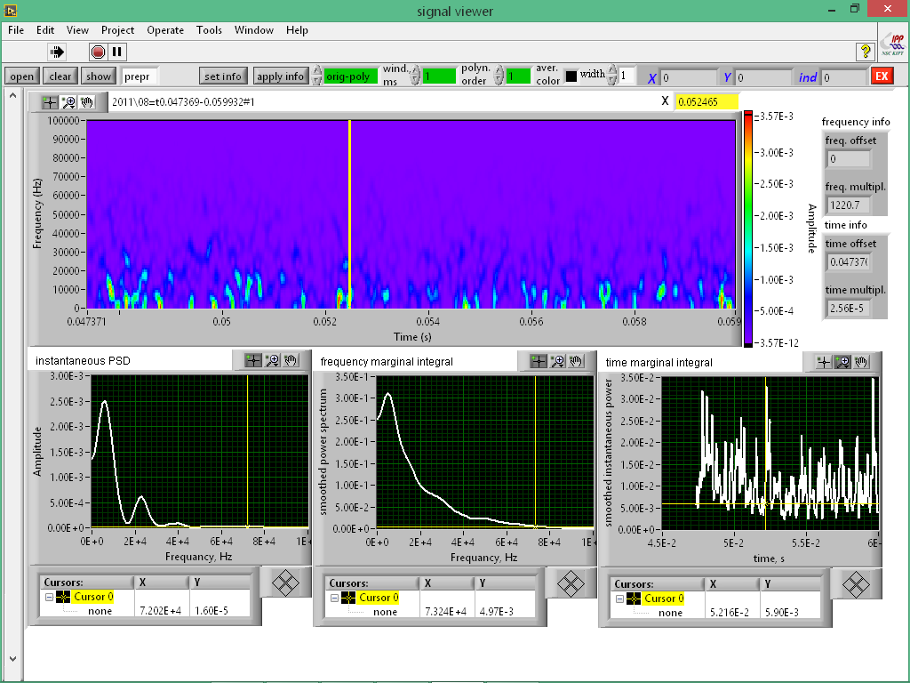

This LabView code for analog digital converter (ADC) data processing
have been created in order to view Langmuir probe signals registered
in the URAGAN-3M torsatron using different ADCs and obtain its spectral
and statistical characteristics.(V.Voitsenya et al., Progress in stellarator
research in Kharkov IPP, Phys. Scr. T161 (2014) 014009 (7pp)
doi:10.1088/0031-8949/2014/T161/014009)

For now it is possible to process the next binary formats:

1. L-Card L-783M, http://www.lcard.ru/products/boards/l-783
2. L-Card e20-10, http://www.lcard.ru/products/external/e20-10
3. SATURN SDI-AD12-128H, http://www.saturn-data.com

ADC files examples are included in the "resources/sampledata/" subfolder.
Check "resources/png/" subfolder with screenshots.

An information about every signal will be extracted from an appropriate
binary *.par file  in correspondence with a chosen binary *.dat file
or from the beginning of a chosen *.dat file in case of SATURN SDI-AD12-128H
Plain text format is also allowed.

